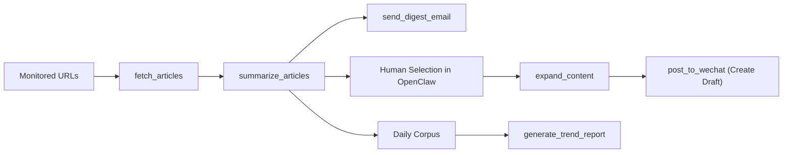

# OpenClaw-InfoLoop

## 项目简介 / Project Overview

### 中文
InfoLoop 是一个面向 OpenClaw 的 AI 驱动、Human-in-the-Loop（HITL）内容运营引擎。它的目标不是完全替代人工编辑，而是把高频、重复、结构化的内容工作拆分成可协同的技能模块：自动发现信息、生成摘要、发送候选清单、扩写为长文草稿、生成次日监控策略。最终是否发布、如何发布、发布到什么程度，仍由人工控制。

这个仓库当前聚焦一个非常明确的交付场景：围绕网页信息监控和微信公众号内容生产，构建一条可验证、可配置、可测试的内容操作闭环。项目强调两件事：

- 自动化负责提效，而不是替代判断。
- 结构化接口和可测试实现优先于“看起来很智能”的黑盒能力。

### English
InfoLoop is an AI-driven, human-in-the-loop content operations engine for OpenClaw. Its purpose is not to replace editors end to end, but to decompose repetitive content work into coordinated skills: discover signals, summarize materials, send indexed digests, expand selected items into long-form drafts, and generate next-day monitoring strategy. Final publishing decisions remain explicitly controlled by a human operator.

This repository currently targets a concrete delivery scenario: web monitoring plus WeChat Official Account content production. The project optimizes for two things:

- Automation should improve throughput without removing editorial judgment.
- Structured interfaces and testable implementations matter more than opaque “smart” behavior.

## Human-in-the-loop 工作流 / Operating Loop

### 中文
InfoLoop 当前实现的是一个四阶段闭环：

1. Discovery：从监控 URL 中抓取候选文章，提取标题、分类、发布时间和正文。
2. Selection：把候选内容整理为编号摘要，通过邮件发给用户，便于在 OpenClaw 对话中用 `[1]`、`[2]` 这样的方式做选择。
3. Production：基于用户选中的条目生成微信公众号长文草稿，并可创建微信草稿箱 draft。
4. Evolution：分析每日语料中的实体、关键词和主题趋势，输出次日监控建议。

在这条链路里，AI 负责聚合、归纳、扩写和建议，人工负责筛选、复核和最终发布决策。这也是本项目对 HITL 的具体落地方式。

### English
InfoLoop currently implements a four-stage operating loop:

1. Discovery: fetch candidate articles from monitored URLs and extract title, category, publication date, and body text.
2. Selection: turn candidates into indexed summaries and deliver them by email, so the user can refer to `[1]`, `[2]`, and so on inside OpenClaw chat.
3. Production: expand selected items into long-form WeChat-ready drafts and create WeChat Official Account drafts.
4. Evolution: analyze the daily corpus, surface recurring entities and keywords, and recommend next-day monitoring strategy.

Within this loop, AI handles aggregation, summarization, expansion, and recommendation. Humans remain responsible for selection, verification, and final publishing decisions. That is the practical HITL boundary in this project.

## 系统架构与模块职责 / Architecture and Module Responsibilities

### 中文
当前系统由 4 个核心技能模块组成：

- `web_radar.py`
  - 负责抓取网页、提取正文、分类和发布时间。
  - 支持关键词过滤。
  - 摘要阶段优先使用 Qwen，失败时回退到本地规则摘要。
- `mail_notifier.py`
  - 把候选摘要渲染为带编号的 HTML Digest。
  - 通过 SMTP 发送给目标邮箱。
  - 邮件中会保留标题、分类、摘要和可选来源链接。
- `content_studio.py`
  - 根据用户选中的编号和原始缓存生成长文草稿。
  - 优先调用 Qwen 扩写，失败时回退到本地长文模板。
  - 支持创建微信公众平台草稿，不直接执行“正式发布”。
- `trend_analyzer.py`
  - 从每日语料中提取实体和关键词。
  - 优先调用 Qwen 输出结构化趋势报告，失败时回退到本地频次与规则分析。

可用工具关系如下：



### English
The current system is built around four core skill modules:

- `web_radar.py`
  - Fetches web pages and extracts article text, category, and publication date.
  - Supports keyword filtering.
  - Uses Qwen first for summaries and falls back to deterministic local summarization.
- `mail_notifier.py`
  - Renders an indexed HTML digest for candidate articles.
  - Sends the digest through SMTP.
  - Keeps title, category, summary, and optional source link in the email.
- `content_studio.py`
  - Expands user-selected items into long-form article drafts.
  - Uses Qwen first for expansion and falls back to a local article template.
  - Creates WeChat Official Account drafts, but does not perform final publish.
- `trend_analyzer.py`
  - Extracts entities and keywords from the daily corpus.
  - Uses Qwen first for structured trend reports and falls back to local heuristic analysis.

The tool relationship is shown above in the flow diagram.

## 目录结构 / Project Structure

### 中文
当前仓库结构如下：

```text
OpenClaw-InfoLoop/
├── skills/
│   ├── web_radar.py
│   ├── mail_notifier.py
│   ├── content_studio.py
│   ├── trend_analyzer.py
│   └── __init__.py
├── config/
│   └── manifest.yaml
├── tests/
│   ├── conftest.py
│   ├── test_web_radar.py
│   ├── test_mail_notifier.py
│   ├── test_content_studio.py
│   └── test_trend_analyzer.py
├── .env.example
├── .gitignore
├── requirements.txt
└── README.md
```

### English
The current repository layout is:

```text
OpenClaw-InfoLoop/
├── skills/
│   ├── web_radar.py
│   ├── mail_notifier.py
│   ├── content_studio.py
│   ├── trend_analyzer.py
│   └── __init__.py
├── config/
│   └── manifest.yaml
├── tests/
│   ├── conftest.py
│   ├── test_web_radar.py
│   ├── test_mail_notifier.py
│   ├── test_content_studio.py
│   └── test_trend_analyzer.py
├── .env.example
├── .gitignore
├── requirements.txt
└── README.md
```

## 环境变量与配置说明 / Environment Variables and Configuration

### 中文
当前模板文件 [`.env.example`](/D:/Codex/OpenClaw-InfoLoop/.env.example) 中定义了以下环境变量：

#### Qwen / DashScope
- `QWEN_API_KEY`
- `QWEN_BASE_URL`
- `QWEN_MODEL`

#### WeChat Official Account
- `WECHAT_APP_ID`
- `WECHAT_APP_SECRET`
- `WECHAT_AUTHOR`
- `WECHAT_CONTENT_SOURCE_URL`
- `WECHAT_COVER_IMAGE_PATH`
- `WECHAT_COVER_MEDIA_ID`
- `WECHAT_SHOW_COVER_PIC`

#### SMTP
- `SMTP_HOST`
- `SMTP_USER`
- `SMTP_PASS`
- `TARGET_EMAIL`

#### Proxy
- `PROXY_URL`
- `HTTP_PROXY`

#### Content Generation
- `CONTENT_STUDIO_MODEL`

配置要点：

- 代理优先级为 `PROXY_URL`，回退到 `HTTP_PROXY`。
- 微信草稿创建要求至少提供 `WECHAT_COVER_MEDIA_ID` 或 `WECHAT_COVER_IMAGE_PATH` 其中之一。
- `post_to_wechat` 当前语义是“创建微信草稿”，不是正式发布到公众号。
- `mail_notifier` 当前以模板中的 SMTP 账号配置为主，默认会按常规 SMTP + TLS 方式发送。

### English
The current [`.env.example`](/D:/Codex/OpenClaw-InfoLoop/.env.example) template exposes the following variables:

#### Qwen / DashScope
- `QWEN_API_KEY`
- `QWEN_BASE_URL`
- `QWEN_MODEL`

#### WeChat Official Account
- `WECHAT_APP_ID`
- `WECHAT_APP_SECRET`
- `WECHAT_AUTHOR`
- `WECHAT_CONTENT_SOURCE_URL`
- `WECHAT_COVER_IMAGE_PATH`
- `WECHAT_COVER_MEDIA_ID`
- `WECHAT_SHOW_COVER_PIC`

#### SMTP
- `SMTP_HOST`
- `SMTP_USER`
- `SMTP_PASS`
- `TARGET_EMAIL`

#### Proxy
- `PROXY_URL`
- `HTTP_PROXY`

#### Content Generation
- `CONTENT_STUDIO_MODEL`

Configuration notes:

- Proxy resolution prefers `PROXY_URL` and falls back to `HTTP_PROXY`.
- WeChat draft creation requires either `WECHAT_COVER_MEDIA_ID` or `WECHAT_COVER_IMAGE_PATH`.
- `post_to_wechat` currently means “create a WeChat draft”, not “publish live”.
- `mail_notifier` currently assumes a standard SMTP plus TLS delivery path using the configured account.

## 安装与快速开始 / Installation and Quick Start

### 中文
1. 使用 Python `3.10+`。
2. 安装依赖：

```bash
python -m pip install -r requirements.txt
```

3. 创建本地环境配置：

```bash
copy .env.example .env
```

4. 按你的环境填写 `.env`。
5. 先执行本地 smoke checks，确认模块入口可运行：

```bash
python skills/web_radar.py
python skills/mail_notifier.py
python skills/content_studio.py
python skills/trend_analyzer.py
```

### English
1. Use Python `3.10+`.
2. Install dependencies:

```bash
python -m pip install -r requirements.txt
```

3. Create your local environment file:

```bash
copy .env.example .env
```

4. Fill the `.env` values for your environment.
5. Run local smoke checks before integration:

```bash
python skills/web_radar.py
python skills/mail_notifier.py
python skills/content_studio.py
python skills/trend_analyzer.py
```

## 工具调用链路 / Tool Workflow

### 中文
推荐的端到端调用顺序如下：

1. `fetch_articles`
   - 输入：`urls`、可选 `keywords`
   - 输出：原始文章记录，包括 `url/title/publication_date/category/content`
2. `summarize_articles`
   - 输入：上一步的原始文章记录
   - 输出：结构化摘要记录，包括 `index/title/category/summary`
3. `send_digest_email`
   - 输入：摘要记录数组
   - 输出：是否发送成功的布尔值
4. 人工在 OpenClaw 中选择条目编号
5. `expand_content`
   - 输入：`selected_indices` 和 `full_cache`
   - 输出：长文草稿对象，包含 `title` 与 `content`
6. `post_to_wechat`
   - 输入：草稿标题和正文
   - 输出：微信草稿创建结果，包含 `status/access_token/thumb_media_id/draft_media_id`
7. `generate_trend_report`
   - 输入：每日语料数组 `all_daily_text`
   - 输出：`document_count/top_entities/top_keywords/next_day_strategy`

一个典型的工作流是：先抓取和摘要，再通过邮件把候选列表发给用户；用户在对话里挑选编号后，再扩写成公众号草稿；同时把每日语料累积起来生成次日监控策略。

### English
The recommended end-to-end workflow is:

1. `fetch_articles`
   - Input: `urls`, optional `keywords`
   - Output: raw article records with `url/title/publication_date/category/content`
2. `summarize_articles`
   - Input: raw article records from the previous step
   - Output: structured summary records including `index/title/category/summary`
3. `send_digest_email`
   - Input: the summary record array
   - Output: boolean delivery result
4. Human selection happens inside OpenClaw chat
5. `expand_content`
   - Input: `selected_indices` and `full_cache`
   - Output: a long-form article object with `title` and `content`
6. `post_to_wechat`
   - Input: draft title and draft content
   - Output: WeChat draft creation result with `status/access_token/thumb_media_id/draft_media_id`
7. `generate_trend_report`
   - Input: daily corpus array `all_daily_text`
   - Output: `document_count/top_entities/top_keywords/next_day_strategy`

A typical operating path is: fetch and summarize first, email the candidate digest to the user, let the user choose item numbers in chat, expand the selected items into a WeChat draft, and separately accumulate the daily corpus for next-day strategy generation.

## 各技能说明 / Skill Reference

### 中文
#### `fetch_articles`
- 负责抓取页面并提取文章结构化字段。
- 支持关键词过滤。
- 网络异常会记录日志并跳过失败 URL。

#### `summarize_articles`
- 优先调用 Qwen 生成约 100 词摘要。
- 失败时会回退到本地摘要逻辑。
- 返回的摘要记录可直接用于邮件和后续选择。

#### `send_digest_email`
- 生成纯文本 + HTML 双版本邮件。
- HTML 版本带编号，适合用户在对话中引用。
- 返回值是布尔值，表示发送是否成功。

#### `expand_content`
- 将用户选中的候选记录扩写为长文。
- 当前实现要求输出至少约 800 字的正文。
- 无 Qwen 或生成失败时，回退到本地长文模板。

#### `post_to_wechat`
- 当前实现是“创建微信草稿”而不是“正式发布”。
- 依赖 `WECHAT_APP_ID`、`WECHAT_APP_SECRET` 和封面素材配置。
- 返回草稿 `media_id` 等元信息，供后续流程使用。

#### `generate_trend_report`
- 从每日语料中提取实体与关键词。
- 返回结构化趋势报告。
- 失败时回退到基于频次和规则的本地分析。

### English
#### `fetch_articles`
- Fetches pages and extracts structured article fields.
- Supports keyword filtering.
- Logs network failures and skips unreachable URLs.

#### `summarize_articles`
- Uses Qwen first to generate roughly 100-word summaries.
- Falls back to local deterministic summarization on failure.
- Returns summary records that can be used directly for email and selection.

#### `send_digest_email`
- Produces both plain text and HTML email bodies.
- The HTML version is indexed for easy reference inside chat.
- Returns a boolean delivery result.

#### `expand_content`
- Expands user-selected source items into a long-form article.
- The current implementation expects at least roughly 800 characters of body text.
- Falls back to a local long-form template when Qwen is unavailable or fails.

#### `post_to_wechat`
- The current implementation creates a WeChat draft rather than publishing live.
- Depends on `WECHAT_APP_ID`, `WECHAT_APP_SECRET`, and cover asset configuration.
- Returns draft metadata such as the resulting `media_id`.

#### `generate_trend_report`
- Extracts entities and keywords from the daily corpus.
- Returns a structured trend report.
- Falls back to local heuristic analysis if Qwen is unavailable or fails.

## 测试与验证 / Testing and Validation

### 中文
当前测试已经迁移到新的 InfoLoop 模块结构，测试文件包括：

- [test_web_radar.py](/D:/Codex/OpenClaw-InfoLoop/tests/test_web_radar.py)
- [test_mail_notifier.py](/D:/Codex/OpenClaw-InfoLoop/tests/test_mail_notifier.py)
- [test_content_studio.py](/D:/Codex/OpenClaw-InfoLoop/tests/test_content_studio.py)
- [test_trend_analyzer.py](/D:/Codex/OpenClaw-InfoLoop/tests/test_trend_analyzer.py)

运行方式：

```bash
python -m pytest -q
```

当前状态：

- 测试集已迁移到新模块结构
- 完整测试已通过
- 当前通过数为 `10 passed`

### English
The test suite has already been migrated to the new InfoLoop module structure. The active test files are:

- [test_web_radar.py](/D:/Codex/OpenClaw-InfoLoop/tests/test_web_radar.py)
- [test_mail_notifier.py](/D:/Codex/OpenClaw-InfoLoop/tests/test_mail_notifier.py)
- [test_content_studio.py](/D:/Codex/OpenClaw-InfoLoop/tests/test_content_studio.py)
- [test_trend_analyzer.py](/D:/Codex/OpenClaw-InfoLoop/tests/test_trend_analyzer.py)

Run the full suite with:

```bash
python -m pytest -q
```

Current validation status:

- The test suite matches the new module structure
- The full suite is passing
- The current result is `10 passed`

## 当前状态、限制与后续计划 / Current Status, Limitations, and Next Steps

### 中文
当前项目已经完成 Step 1-5 对应的主体实现：

- 项目结构和配置基线已建立
- Discovery、Selection 支撑、Production 草稿生成、Evolution 趋势分析已可运行
- `manifest.yaml` 已与当前实现对齐
- 测试已迁移并通过

当前限制：

- `post_to_wechat` 目前只创建微信草稿，不直接做正式发布。
- 邮件发送链路当前以常规 SMTP + TLS 为主，复杂企业邮件环境可能还需要进一步兼容。
- 选图与封面素材目前主要通过环境变量配置，尚未扩展成更灵活的运行时参数。
- Qwen 不可用时系统会回退到本地逻辑，保证流程不中断，但产出质量会低于模型路径。

建议的下一步：

1. 增加微信正式发布阶段与更明确的状态管理。
2. 增强 SMTP 兼容性，例如更多端口和 SSL/TLS 模式支持。
3. 继续细化 OpenClaw 集成层，把工具链编排成更完整的自动化工作流。
4. 根据实际运营反馈优化摘要风格、长文模板和趋势报告规则。

### English
The project has completed the main implementation scope corresponding to Steps 1-5:

- Project structure and configuration baseline are in place
- Discovery, selection support, production draft generation, and evolution analysis are operational
- `manifest.yaml` is aligned with the current implementation
- The test suite has been migrated and is passing

Current limitations:

- `post_to_wechat` currently creates WeChat drafts but does not perform final publish.
- The mail delivery path currently focuses on standard SMTP plus TLS; more complex enterprise mail environments may require additional compatibility work.
- Cover image handling is primarily environment-driven and has not yet been expanded into a richer runtime interface.
- When Qwen is unavailable, the system falls back to local logic to keep the workflow alive, but output quality will be lower than the model-assisted path.

Recommended next steps:

1. Add an explicit live-publish stage for WeChat with clearer status transitions.
2. Improve SMTP compatibility, including broader SSL/TLS handling.
3. Continue refining the OpenClaw integration layer into a more complete automated workflow.
4. Tune summary style, article templates, and trend-report rules based on real editorial feedback.
